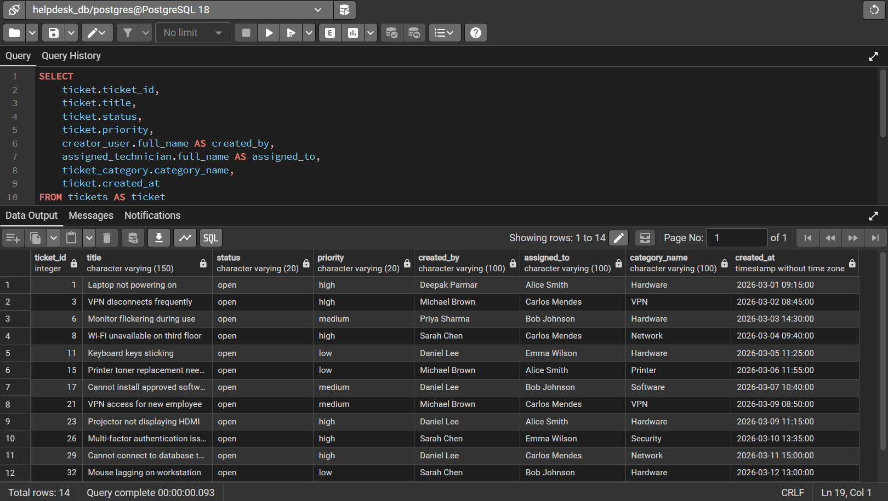
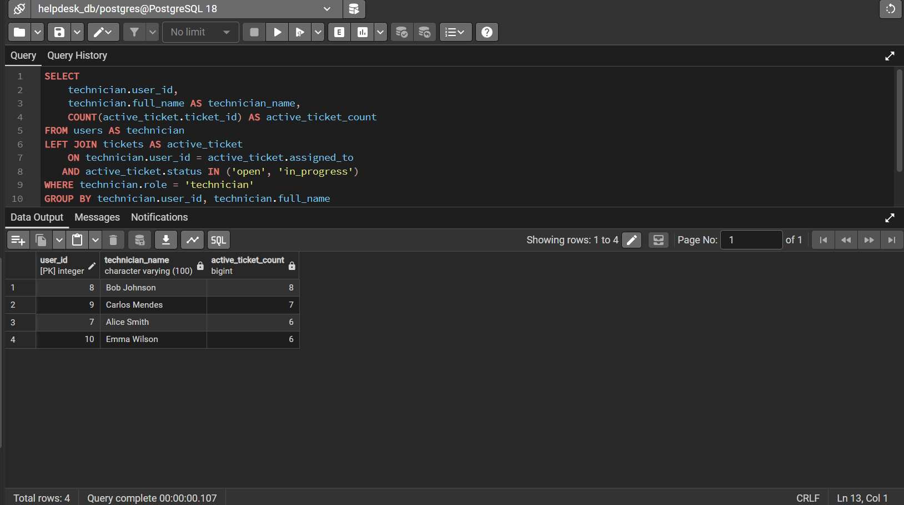
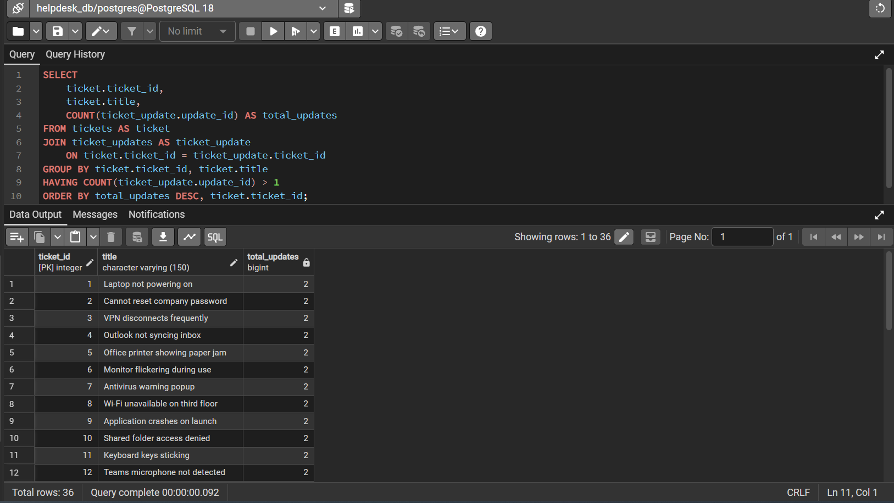
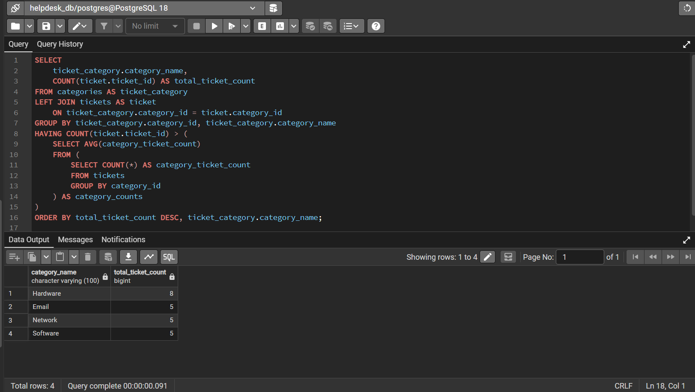
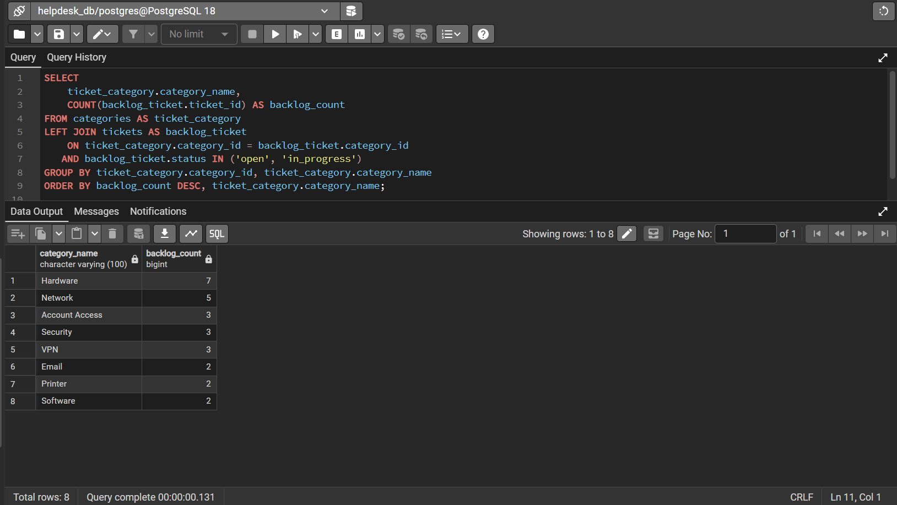
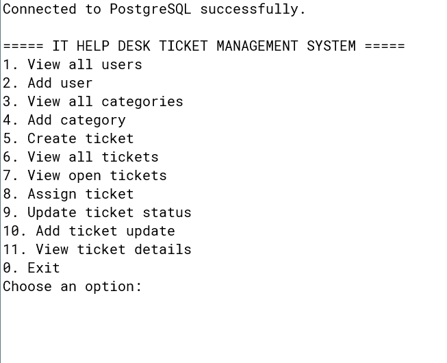
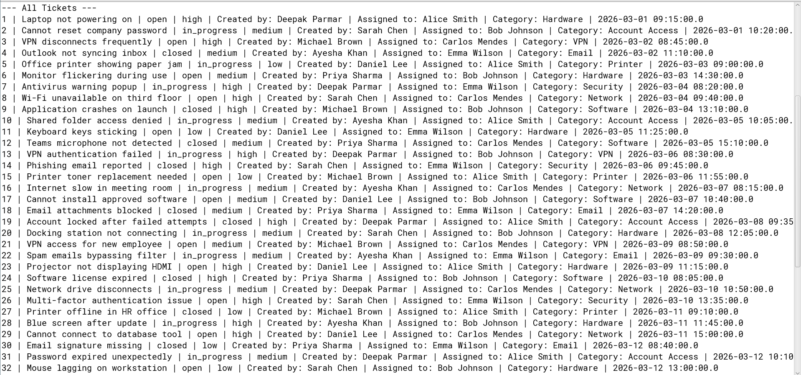
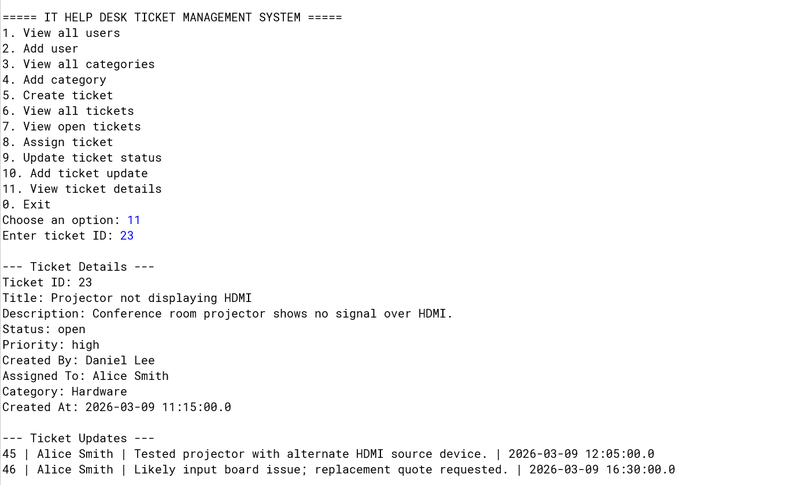
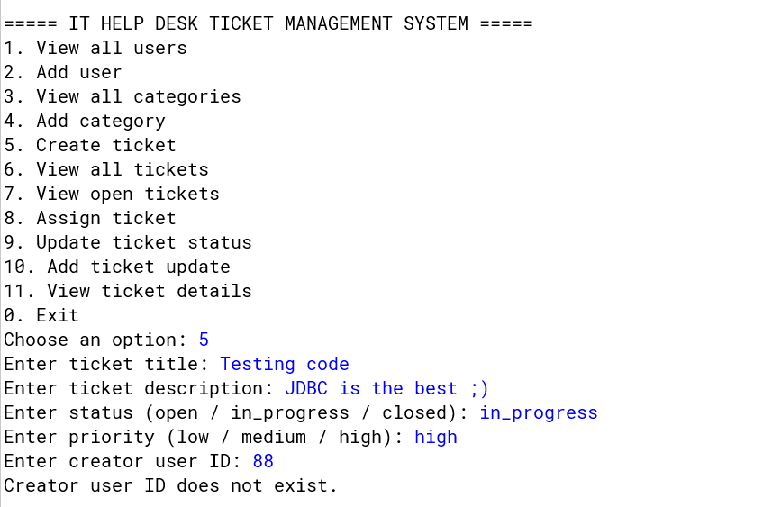
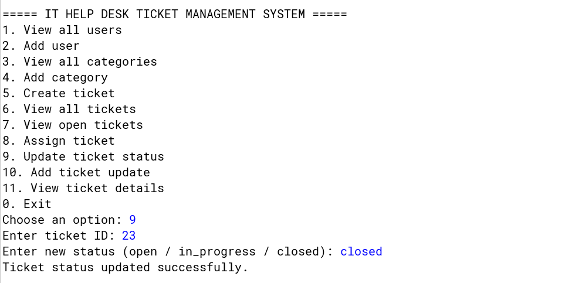

# IT Help Desk Ticket Management System

A Java-based console application integrated with PostgreSQL that simulates a real-world IT help desk system for managing support tickets, users, categories, and ticket updates.

This project demonstrates database design, complex SQL queries, and backend application development using JDBC.

---

## 🚀 Features

- Add and manage users (employees, technicians, admins)
- Create and manage support tickets
- Assign tickets to technicians
- Update ticket status (open, in progress, closed)
- Add update notes to tickets
- View detailed ticket history
- Execute advanced SQL queries for reporting and analytics

---

## 🛠️ Tech Stack

- Java (JDBC)
- PostgreSQL
- pgAdmin 4
- BlueJ (IDE)

---

## 🧱 Database Design

The system uses a relational database with the following tables:

- `users` – stores employees, technicians, and admins
- `categories` – ticket categories (Hardware, Software, Network, etc.)
- `tickets` – main ticket data
- `ticket_updates` – history and updates for tickets

### Entity Relationship Diagram


---

## 📊 Sample SQL Queries & Results

### Open Tickets Overview (JOIN)


### Technician Workload (GROUP BY)


### Complex Tickets (Multiple Updates - HAVING)


### High Activity Categories (SUBQUERY)


### Backlog Analysis (REAL-WORLD REPORT)


---

## 💻 Application Screenshots

### Main Menu


### View All Tickets


### Ticket Details with Updates


### Create Ticket


### Update Ticket Status


---

## ⚙️ Setup Instructions

### 1. Clone the repository

```bash
git clone https://github.com/your-username/helpdesk-ticket-system.git
