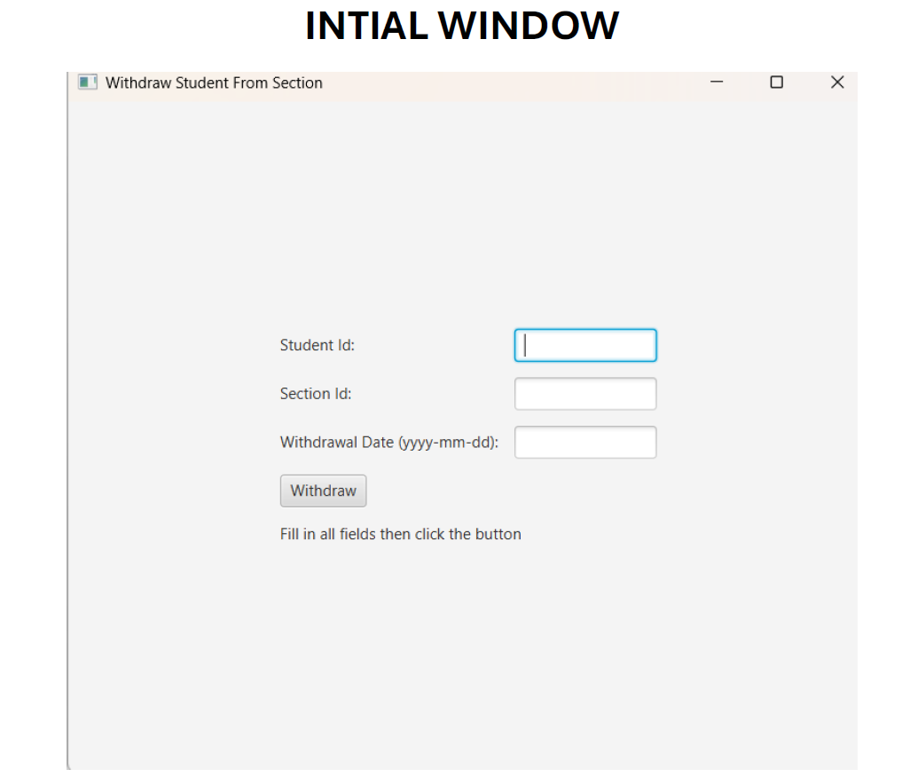
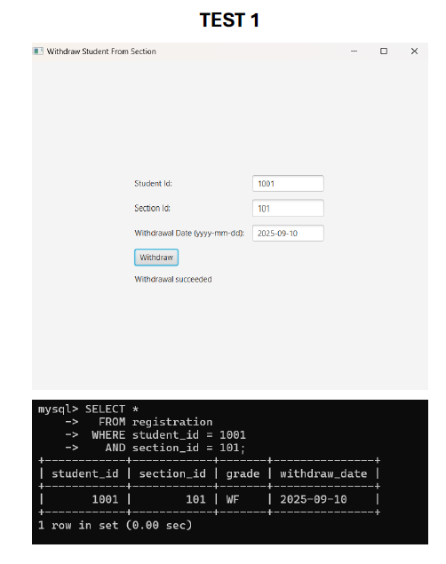
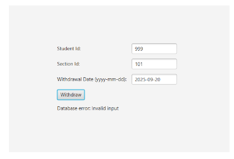
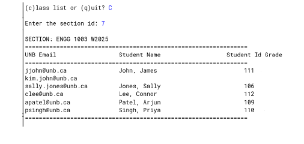

# Student Course Management System (Java + MySQL)

This project demonstrates database interaction using Java (JDBC) with a MySQL backend. It includes both GUI and command-line tools for managing student course data.

## 🚀 Features

- Withdraw a student from a section (JavaFX GUI)
- View class list for a section (CLI-based)
- Uses stored procedures and SQL queries
- Demonstrates JDBC concepts (PreparedStatement, CallableStatement)

## 🛠️ Technologies Used

- Java
- JavaFX
- MySQL
- JDBC

## 📂 Files

- `WithdrawFromSection.java` → GUI app to withdraw students
- `ClassList.java` → Simple CLI class list viewer
- `ClassList2.java` → Enhanced version with better error handling

## ⚙️ Setup Instructions

1. Install MySQL and create database:
   ```sql
   CREATE DATABASE unbcourse;


## 📸 Screenshots

### GUI Application






### CLI Output

